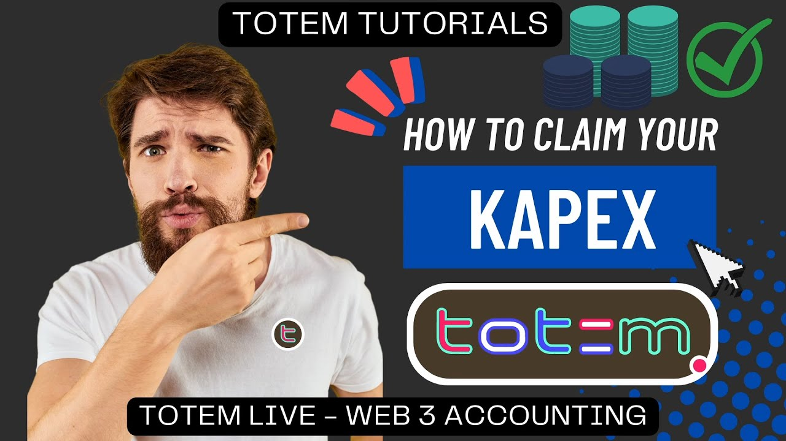
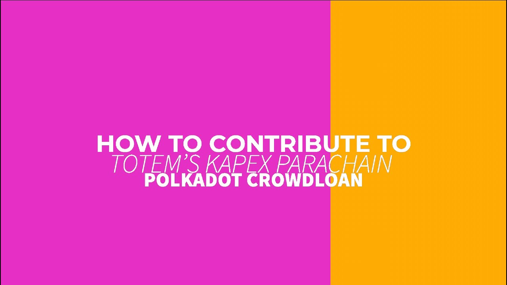
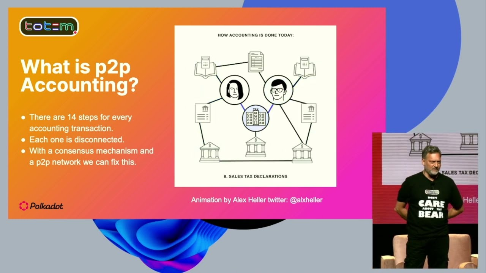
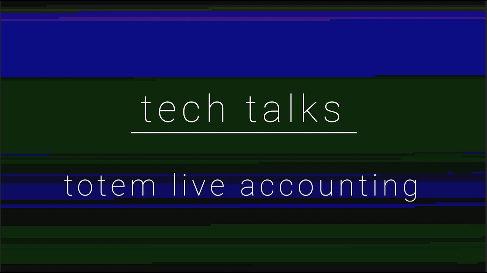
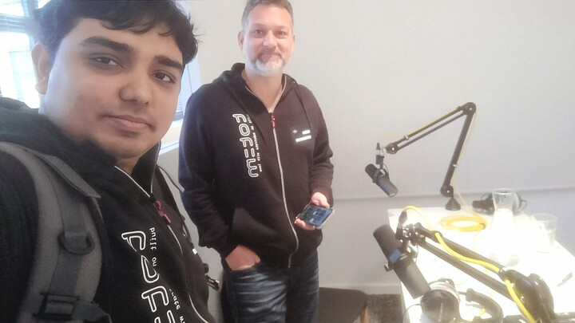
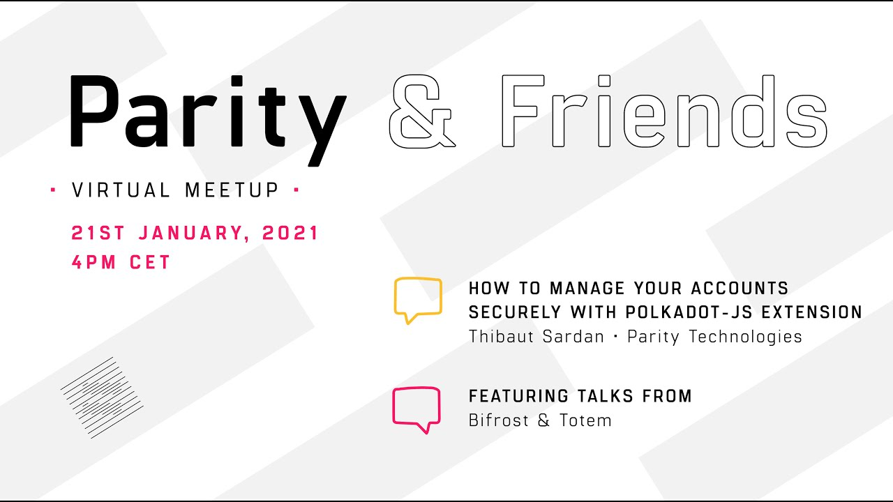

<!-- PDF-IGNORE-START -->
<!-- Header block will be replaced by PDF generation script (.github/scripts/md_to_pdf.py). Make sure to keep both the script and this file update to date with contact details -->
# Toufiqur R. Chowdhury
  
📫 **Contact:** Please see my [ATS-Friendly CV (PDF)](https://alien45.github.io/cv/Toufiqur_Chowdhury_CV.pdf) for full contact details.  
🌍 **Location:** Antalya, Turkiye  
💻 **LinkedIn:** [linkedin.com/in/toufiq](https://linkedin.com/in/toufiq)  
💻 **GitHub:** [github.com/alien45](https://github.com/alien45)  
<!-- PDF-IGNORE-END -->

---

## Summary

Full-stack developer with 8+ years of experience building scalable web apps, developer tools, and decentralized platforms. Led full frontend and backend development at Totem Live Accounting, designing robust off-chain architecture and modular systems. Adaptable engineer who rapidly learns new ecosystems, from Python and Golang to AngularJS and Polkadot, and delivers production-ready features fast.

  

## Education  

<h3 id="edu-greenwich">BEng Software Engineering (First Class with Honours)</h3>  

[University of Greenwich](https://www.gre.ac.uk/), London, UK (2011–2014)

**Final Year Project (Indoor Positioning via WiFi Fingerprinting):** Designed and built a proof-of-concept Android app for WiFi fingerprinting and real-time indoor location tracking using signal strength, triangulation, and basic ML via SDKs.  

<!-- PDF-IGNORE-START -->

- Contributed 25% of the total degree weight.
- Implemented custom indoor mapping, location estimation via Dijkstra’s algorithm.
- Focused on hands-on coding, not just theoretical reporting.

>[Project report PDF available here](assets/university_of_greenwich/final-year-project-report.pdf)  

<!-- PDF-IGNORE-END -->  

<h2 id="experience">Experience</h2>  

<h3 id="exp-nextion">  
  Nextion, US - Full Stack Developer (Remote)  
</h3>  

**Feb 2025 – Present**  

**Tech:** React, TypeScript, Zod, Vite, Tanstack Table, React Hook Form, Python, FastAPI, Postgres, Redis  
 
- Developed a trade approval, re-/execution, and monitoring UI with batch order queuing, powered by Redis-based quant engine and IB gateway  
- Fast-tracked Python with AI to ship FastAPI backend using Docker & Postgres  
- Enabled analytics by exposing backend metrics, execution states, and historical portfolio snapshots  
- Wrote an interactive shell script to set up Postgres with reusable, idempotent schema and automated entry of audit logs using Postgres triggers  

<h3 id="exp-totem">
  <a href="https://totemaccounting.com">
    Totem Live Accounting, CH
  </a> - Co-founder & Lead Developer (Remote)
</h3>  

**Mar 2019 – Mar 2024**  

**Tech:** JavaScript, React, Node.js, CouchDB, Polkadot.js, WebSockets, Semantic UI React, Material UI, TweetNaCl.js  

**Core Contributions:**  

- Sole developer of the entire frontend & off-chain Node.js backend  
- In-app Blockchain wallet, partner & team management and timekeeping & financial statement viewer  
- Marketplace with proposal submission & approval with automated payouts on completion  
- Streamlined user onboarding flow with signup, faucet, backup & diff-aware selective restore system and in-app notifications & chat  
- Engineered a sequential & resumable on/off-chain transaction queue with history UI for debugging and transparency  
- Co-designed and implemented **BONSAI**, an innovative dual on/off-chain proof system using hash anchoring and token-based verification. <!-- PDF-IGNORE-START -->

  ><b>BONSAI:</b> Blockchainization of NoSQL Storage Authorization & Identification. In other words, a decentralized 2 Factor Authentication mechanism with full control over exactly what is being done/stored.

<!-- PDF-IGNORE-END -->  
- Launched the Crowdloan & Pledge DApp, raising $1+M in the Polkadot Parachain auction and $83.6K in the pledge round  
- Secured & encrypted inter-microservice communication with [TweetNaCl.js](https://tweetnacl.js.org)  
- Authored cross-stack library `common-utils` with Reactive hooks, components, JSON storage & CouchDB helper and form + API data validation library  
- Automated CI with GitLab webhooks and custom scripts for source-committed builds and improved release traceability  
- Coded and deployed [Totem Live Accounting](https://totemaccounting.com/) homepage from design specs  
- Architected semi-automated tooling for multilingual support for API & frontend  

  
**Community Contributions:**  

- Boosted user retention, social engagement & bug discovery through gamified rewards engine and responsive onboarding  
- Launched and ran the Totem Ambassador Program  
- Led multilingual Telegram and Twitter engagement, doubling community engagement and improving support responsiveness across 6+ language groups  
- Provided user support by in-app live chat, socials and led feature walk-throughs  
 
**Demo Of My Work:**
[Totem.Live DApp](https://youtube.com/watch?v=29rViB0SFhA) | 
[Crowdloan DApp](https://www.youtube.com/watch?v=qBLskkm0iDk&t=61s) | 
[Polkadot Decoded](https://www.youtube.com/watch?v=FzqX41_ga2I&t=580s)  <!-- PDF-IGNORE-START --> 

<!-- PDF-IGNORE-END -->
**Podcasts:** 
[Totem Tech Talks](https://www.youtube.com/@totemliveaccounting1312/search?query=tech%20talks) | 
[RelayChain](https://www.youtube.com/watch?v=ceTPR3oY5RA) | 
[Parity & Friends](https://www.youtube.com/live/pryr8DmVMlM?si=sKsGoO7CnRgpJ6mw&t=3080)  <!-- PDF-IGNORE-START -->  

<!-- PDF-IGNORE-END -->
**Open Source:** 
 [Totem UI](https://github.com/totem-tech/totem-ui), 
 [Message Service](https://github.com/totem-tech/totem-message-service), 
 [Common Utils](https://github.com/totem-tech/common-utils)
 and [others](https://github.com/totem-tech)  

<h3 id="exp-omniscape">
  <a href="https://omniscape.com">
    Omniscape, US
  </a>
   - Tokenization Developer (Remote)
</h3>

**May 2021 – Jan 2022**  

- Built the tokenization engine for virtual real estate assets  
- Integrated Stripe and Web3 payment flows  
- Worked on the Virtual Real Estate Map application, a SPA frontend in React + Redux and NodeJS backend, deployed on Firebase  
- Created NodeJS microservice for automation of tokenization transactions using queuing mechanism and singleton pattern  
- Discovered and fixed major security flaws left by ex-dev  
- Engineered a NodeJS microservice for queueing & automation of Web3 payment transactions and randomization of rewards for campaign events  

<h3 id="exp-os-and-other">
  Open Source Work & Other Activities
</h3>

**2017 – 2019**  

- [Halo Info Bot](https://github.com/alien45/halo-info-bot): Discord chatbot in Go for the Halo Platform blockchain and masternode/DEX data  
- [HaloDEX Chart Feed](https://github.com/alien45/halodex-chart-feed): Real-time TradingView charting data server in Go  
- [Cloud Connector](https://github.com/alien45/cloud-connector): Tool for syncing data across AWS S3, GCP, and Azure  
- Wrote a [PhD research proposal (PDF)](https://alien45.github.io/cv/assets/monash-uni-phd-proposal-blockchain-security.pdf) on security vulnerability detection in blockchain-based systems (unfunded)  
- Ran a small GPU-based home crypto mining operation during the early Ethereum days  <!-- PDF-IGNORE-START -->
- Authored a how-to guide and interactive bash script to setup Halo Platform masternode using VPS  

PS: bot name was changed to 'Crypto Price Checker' after shutdown of Halo Platform. The bot is currently off-live.

<!-- PDF-IGNORE-END -->

<h3 id="exp-summit">
  <a href="https://summitinternet.com.au">
    The Summit Group, Melbourne, AU
  </a>
   - Full Stack Developer
</h3>  

**Apr 2016 – Apr 2017**  

- WHMCS payment integration via Ezidebit API  
- SPA admin dashboard for customer billing and invoicing system using AngularJS, deployed with Docker  
- Backend API & microservices using Go, MySQL & RabbitMQ  
- Programmed automation tools in Go for parsing, formatting and storing telecom provider billing data  
- Co-interviewed, helped onboard and mentored an intern

<h3 id="exp-web123">
  <a href="https://web123.com.au/">
    Web123 Pty Ltd, Melbourne, AU
  </a>
   - Full Stack Developer
</h3> 

**Jul 2015 – Mar 2016**  

- Worked with the tech lead on <b title="A WYSIWYG CMS designed to make delivering websites easier for designers and developers.">Foxley CMS</b>, building backend APIs, unit tests (C#/.NET), and UI in AngularJS  
- Turned designs into working responsive websites  

<!-- PDF-IGNORE-START -->
  <h3 id="exp-easyweb">
    <a href="https://easywebdigital.com/">
      Easyweb Digital, Melbourne, AU
    </a>
    - Systems Developer  
  </h3>  

**Sep – Dec 2014**  

- Backbone.js component development  
- UI/UX components using Bootstrap and Underscore  

<!-- 
 -->

<!-- PDF-IGNORE-END -->

## Certifications  
 
- **[Apps for Good](https://www.appsforgood.org/)** (2012) - MVP development, team leadership, and final presentation at Facebook London HQ. Sponsored by Facebook & others.<!-- PDF-IGNORE-START -->  
  - Met entrepreneurs including then Managing Director (Europe) of LinkedIn and others.
  - Attended programming bootcamp by Freeformers

  
  
  

<!-- PDF-IGNORE-END -->  

- **Red Hat Certified Engineer - RHCE** (2009) - 91.2% test score 

## Technical Skills  

**Languages:** JavaScript, TypeScript, Python, Go, C#, PHP    
**Frontend:** React, Tanstack Table, React Hook Form, AngularJS, Redux, Semantic UI React, Material UI, Tailwind, HTML, CSS, Bootstrap  
**Backend:** Node.js, FastAPI, Express.js, Golang, Redis, Postgres, CouchDB, TweetNaCl.js  
**Blockchain:** Polkadot/Substrate, Web3.js, Polkadot.js, NFT, DApps  
**Tools:** Vite, Docker, Firebase, WebSockets, RxJS, Git, GulpJS, RabbitMQ  
**Other:** REST APIs, Webhooks, Microservices, MVP prototyping, Agile  

<!-- PDF-IGNORE-START -->
<!-- Languages and References on PDF will be taken from the pdf_footer.md file-->
## Languages:  

**English:** Fluent | **Bangla**: Native  

## References  
Available on request  

### Recommendations:

> "Toufiqur was my Co-founder at Totem and we worked together for 5 years. I highly recommend him as a full stack developer, he goes above and beyond to deliver, and simply gets what the requirements are with very little to go on. You could not find a better team player, contractor and technical expert. He is honest, straight-forward and driven. In the right circumstances I would not hesitate to work with him again and again."
> 
> **- Chris D'Costa**, Founder @ Totem Live Accounting

> "I've had the pleasure of working with Toufiqur twice - first as his mentor over a decade ago when he was a student, and more recently as a colleague at Omniscape.
>
>Even back then, Toufiqur stood out for his dedication and strong work ethic. Now, as a seasoned professional, he brings those same qualities along with years of valuable experience. He's a fantastic team member - equally capable of leading, collaborating within a group, or taking initiative and working independently.
>
>It's been incredibly rewarding to see Toufiqur grow over the years. I can confidently and wholeheartedly recommend him for any role."
> 
> **- Satwant Signh Kenth**, Co-Founder @ Omniscape

See employer recommendations on [LinkedIn](https://linkedin.com/in/toufiq). 

---
**License:** [Creative Commons Zero v1.0 Universal](https://alien45.github.io/cv/LICENSE)

<!-- padding for GitHub only -->

<!-- PDF-IGNORE-END -->  