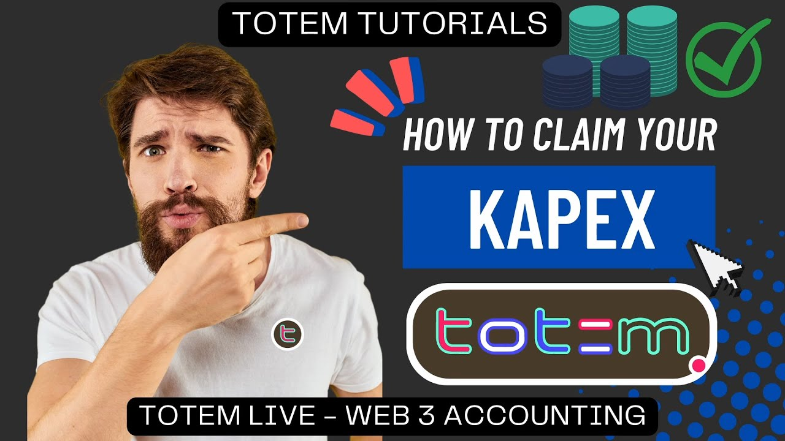
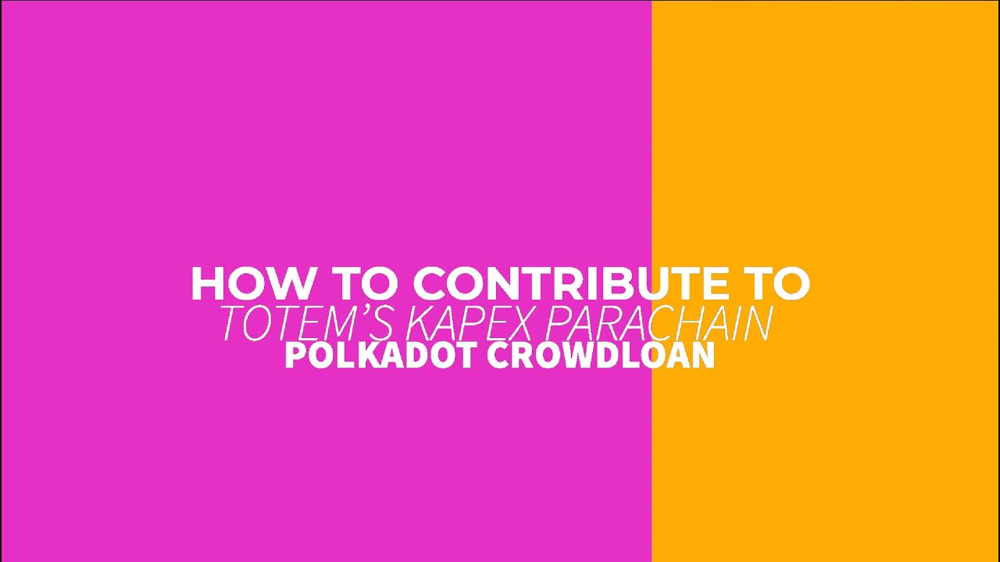
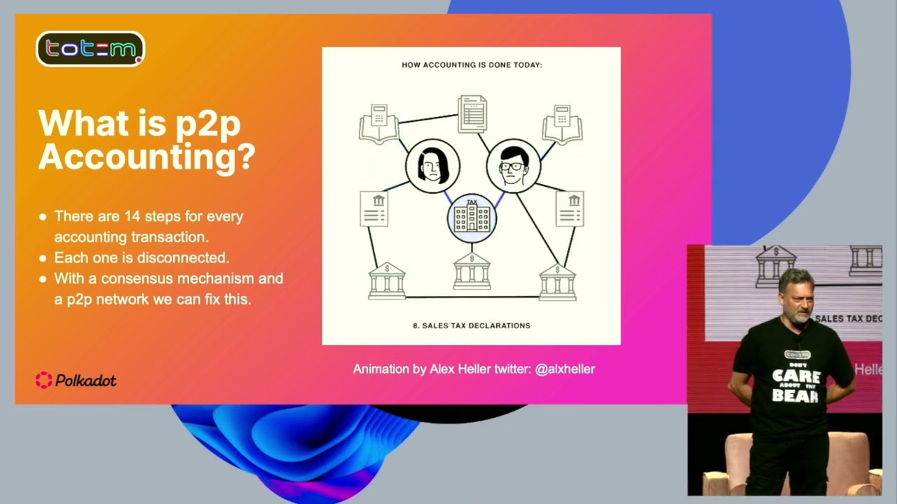
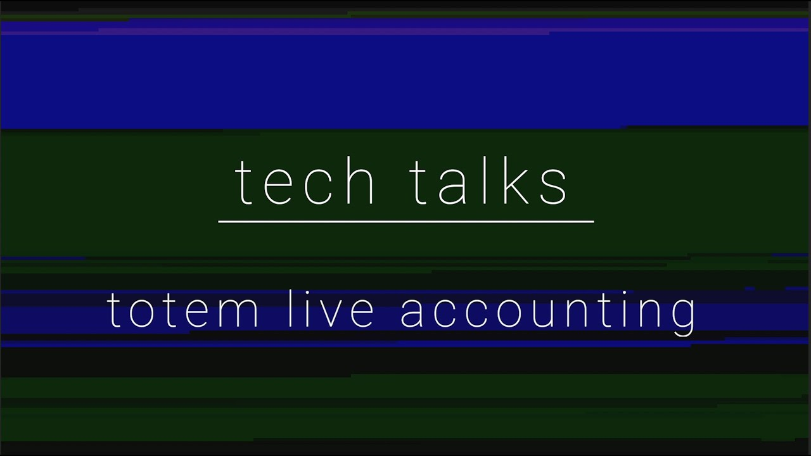
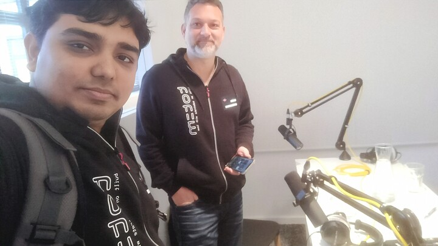
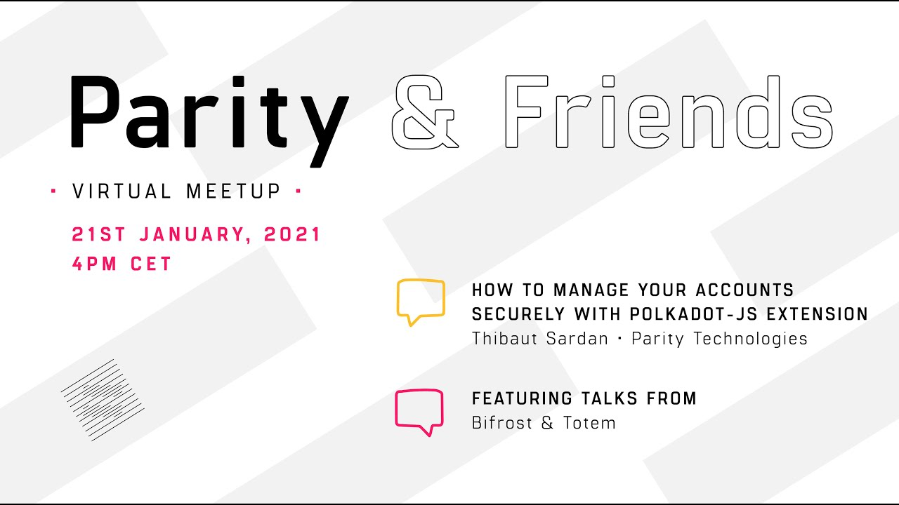

<!-- PDF-IGNORE-START -->
<!-- padding for GitHub only -->
<link rel="stylesheet" href="assets/style.css" />

<!-- Header block will be replaced by PDF generation script (.github/scripts/md_to_pdf.py). Make sure to keep both the script and this file update to date with contact details -->
# Toufiqur R. Chowdhury
  
📫 **Contact:** Please see my [ATS-Friendly CV (PDF)](https://alien45.github.io/cv/Toufiqur_Chowdhury_CV.pdf) for full contact details.  
🌍 **Location:** Antalya, Turkiye (UTC+3)  
💻 **LinkedIn:** [linkedin.com/in/toufiq](https://linkedin.com/in/toufiq)  
💻 **GitHub:** [github.com/alien45](https://github.com/alien45)  
💻 **Journal:** [alien45.github.io/journal](https://alien45.github.io/journal)  
<!-- PDF-IGNORE-END -->

---

## Summary

Senior full-stack engineer with 8+ years of end-to-end ownership. Sole developer of the entire frontend and off-chain backend at Totem Live Accounting for 5 years, including a crowdloan DApp that <b>raised $1M+</b> in a Polkadot parachain auction. Shipped production systems across telecom, fintech, Web3, and quant trading. Creator of <b>@superutils</b>, a TypeScript utility monorepo built on 5 years of battle-tested internals.

## Education  

<h3 id="edu-greenwich">BEng Software Engineering (First Class with Honours)</h3>  

[University of Greenwich](https://www.gre.ac.uk/), London, UK (2011–2014)

**Final Year Project (Indoor Positioning via WiFi Fingerprinting):** Designed and built a proof-of-concept Android app for WiFi fingerprinting and real-time indoor location tracking using signal strength, triangulation, and basic ML via SDKs.  

<!-- PDF-IGNORE-START -->

- Contributed 25% of the total degree weight.
- Implemented custom indoor mapping, location estimation via Dijkstra’s algorithm.
- Focused on hands-on coding, not just theoretical reporting.

>[Project report PDF available here](assets/university_of_greenwich/final-year-project-report.pdf)  

<!-- PDF-IGNORE-END -->  

<h2 id="experience">Experience</h2>  

<h3 id="exp-superutils">
  <a href="https://github.com/alien45/superutils">@superutils</a> - Open Source Developer and Maintainer (Remote)
</h3>  

**Jul 2025 – Present**  

**Tech:** Typescript, React, RxJS, Vite, Vitest, Vitepress, TypeDoc, Lerna, NX, NPM, CI/CD

- Creator and maintainer of a published TypeScript utility monorepo with [4 packages](https://npmjs.com/org/superutils), complete documentation, and full test coverage
- Built a typed fetch wrapper with automatic retries, timeouts, and cancellable debounced requests, plus [`ApiClient`](https://www.npmjs.com/package/@superutils/fetch#api-client) for isolated per-endpoint instances and [`fetchFunc`](https://www.npmjs.com/package/@superutils/fetch#fetch-func) for compatibility with third-party HTTP libraries
- Designed an observable data store built on RxJS for reactive, type-safe state management across both Node and browser environments
- Established consistent API design, strict TypeScript typing, and automated documentation<!-- PDF-IGNORE-START -->
  
This monorepo is the direct, public evolution of [common-utils](https://github.com/totem-tech/common-utils) - an internal 
cross-stack library built and battle-tested at Totem Live Accounting over 5 years. 
Where common-utils solved immediate product needs, @superutils is its intentional 
rewrite for public consumption: clean APIs, complete documentation, full test 
coverage, and backwards compatibility as a first-class constraint from day one. 

The deferred execution model across [@superutils/promise](https://npmjs.com/package/@superutils/promise) and [@superutils/fetch](https://npmjs.com/package/@superutils/fetch) reflects a deliberate design philosophy: async complexity (cancellation, debouncing, timeout, 
retry) should be composable at the call site, not scattered across components. 
[PromisE.deferred()](https://www.npmjs.com/package/@superutils/promise#deferred) is the primitive; [fetch.get.deferred()](https://www.npmjs.com/package/@superutils/fetch#fetch-deferred) is the practical 
application. Both packages are isomorphic and ship browser builds via CDN.   

<b>Links:</b> 
[Open Source](https://github.com/alien45/superutils) |
[NPM](https://www.npmjs.com/org/superutils) |
[Docs](https://alien45.github.io/superutils/)  
<!-- PDF-IGNORE-END -->  

<h3 id="exp-nextion">  
  Nextion, US - Full Stack Developer (Remote)  
</h3>  

**Feb 2025 – July 2025**  

**Tech:** React, TypeScript, Zod, Vite, Tanstack Table, React Hook Form, Python, FastAPI, Postgres, Redis, Interactive Brokers/IB Gateway, RxJS  
 
- Developed a trade approval, re-/execution, and monitoring UI with batch order queuing, powered by Redis-based quant engine and IB gateway  
- Fast-tracked Python with AI to ship FastAPI backend using Docker & Postgres  
- Enabled analytics by using backend metrics, execution states, and historical portfolio snapshots  
- Wrote an interactive shell script to set up Postgres with reusable, idempotent schema and automated entry of audit logs using Postgres triggers  

<h3 id="exp-totem">
  <a href="https://totemaccounting.com">
    Totem Accounting, CH
  </a> - Co-founder & Lead Developer (Remote)
</h3>  

**Mar 2019 – Mar 2024**  

**Tech:** JavaScript, React, Node.js, CouchDB, Polkadot.js, Blockchain, Socket.io, Semantic UI React, Material UI, TweetNaCl.js, Stripe API, RxJS  <!-- PDF-IGNORE-START -->

**Core Contributions:**  

- Sole developer of the entire frontend & off-chain Node.js backend  
- In-app Blockchain wallet, partner & team management and timekeeping & financial statement viewer  
- Marketplace with proposal submission & approval with automated payouts  
- Streamlined user onboarding flow with signup, faucet, backup & diff-aware selective restore system and in-app notifications & chat  
- Engineered a sequential & resumable on/off-chain transaction queue with history UI for debugging and transparency  
- Co-designed and implemented **BONSAI**, an innovative dual on/off-chain proof system using hash anchoring and token-based verification.

  ><b>BONSAI:</b> Blockchainization of NoSQL Storage Authorization & Identification. In other words, a decentralized 2 Factor Authentication mechanism with full control over exactly what is being done/stored.
  
- Launched the Crowdloan & Pledge DApp, raising $1+M in the Polkadot Parachain auction and $83.6K in the pledge round  
- Secured & encrypted inter-microservice communication with [TweetNaCl.js](https://tweetnacl.js.org)  
- Authored cross-stack library `common-utils` with Reactive hooks, components, JSON storage & CouchDB helper and form + API data validation library  
- Automated CI with GitLab webhooks and custom scripts for source-committed builds and improved release traceability  
- Coded and deployed [Totem Live Accounting](https://totemaccounting.com/) homepage from design specs  
- Architected semi-automated tooling for multilingual support for API & frontend  

**Community Contributions:**  

- Boosted user retention, social engagement & bug discovery through gamified rewards engine and responsive onboarding  
- Launched and ran the Totem Ambassador Program  
- Led multilingual Telegram and Twitter engagement, doubling community engagement and improving support across 6+ language groups  
- Provided user support by in-app chat, socials and feature walk-throughs

*Project hit OutOfFundsException, exited with 0.*
 
**Demo Of My Work:**
[Totem.Live DApp](https://youtube.com/watch?v=29rViB0SFhA) | 
[Crowdloan DApp](https://www.youtube.com/watch?v=qBLskkm0iDk&t=61s) | 
[Polkadot Decoded](https://www.youtube.com/watch?v=FzqX41_ga2I&t=580s) 

**Podcasts:** 
[Totem Tech Talks](https://www.youtube.com/@totemliveaccounting1312/search?query=tech%20talks) | 
[RelayChain](https://www.youtube.com/watch?v=ceTPR3oY5RA) | 
[Parity & Friends](https://www.youtube.com/live/pryr8DmVMlM?si=sKsGoO7CnRgpJ6mw&t=3080)  

**Open Source:** 
 [Totem UI](https://github.com/totem-tech/totem-ui), 
 [Message Service](https://github.com/totem-tech/totem-message-service), 
 [Common Utils](https://github.com/totem-tech/common-utils)
 and [others](https://github.com/totem-tech)  

 <!-- PDF-IGNORE-END -->

<ul class='hidden-web'>
  <li>Sole developer of the entire frontend & off-chain Node.js backend for 5 years</li>
  <li>Launched the Crowdloan & Pledge DApp, raising $1M+ in the Polkadot Parachain auction and $83.6K in the pledge round</li>
  <li>Engineered a sequential & resumable on/off-chain transaction queue with history UI for debugging and transparency</li>
  <li>Co-designed and implemented BONSAI, an innovative dual on/off-chain proof system using hash anchoring and token-based verification</li>
  <li>Authored cross-stack library common-utils with reactive hooks, components, CouchDB helpers, and form & API validation - direct predecessor of @superutils</li>
  <li>Streamlined user onboarding flow with signup, faucet, backup & diff-aware selective restore system and in-app notifications & chat</li>
  <li>Marketplace with proposal submission & approval with automated payouts</li>
  <li>Built core DApp modules including in-app blockchain wallet, partner & team management, timekeeping, and financial statement viewer</li>
  <li>Secured inter-microservice communication with TweetNaCl.js and automated CI via GitLab webhooks with source-committed builds</li>
  <li>Drove user retention and bug discovery using gamified rewards engine and responsive onboarding</li>
  <li><b>Demo:</b> <a href="https://">youtube.com/watch?v=29rViB0SFhA</a> | <b>Open Source:</b> <a href="https://github.com/totem-tech">github.com/totem-tech</a></li>
</ul>

<h3 id="exp-omniscape">
  <a href="https://omniscape.com">
    Omniscape, US
  </a>
   - Tokenization Developer (Remote)
</h3>

**May 2021 – Jan 2022**  

**Tech:** JavaScript, React, Node.js, Firestore, Firebase Functions, NFT, Web3, Stripe API

- Built the tokenization engine for virtual real estate assets  
- Integrated Stripe and Web3 payment flows  
- Worked on the Virtual Real Estate Map application, a SPA frontend in React, Redux, Firestore and NodeJS backend deployed using Firebase Functions  
- Discovered and fixed major security flaws left by ex-dev    
- Engineered a NodeJS microservice using queueing and singleton patterns to automate Web3 payments, campaign rewards and tokenization/NFT

<h3 id="exp-os-and-other">
  Open Source Work & Other Activities
</h3>

**2017 – 2019**  

- [Halo Info Bot](https://github.com/alien45/halo-info-bot): Discord chatbot in Go for the Halo Platform blockchain and masternode/DEX data  
- [HaloDEX Chart Feed](https://github.com/alien45/halodex-chart-feed): Real-time TradingView charting data server in Go  
- [Cloud Connector](https://github.com/alien45/cloud-connector): Tool for syncing data across AWS S3, GCP, and Azure  <!-- PDF-IGNORE-START -->
- Wrote a [PhD research proposal (PDF)](https://alien45.github.io/cv/assets/monash-uni-phd-proposal-blockchain-security.pdf) on security vulnerability detection in blockchain-based systems (unfunded)  
- Ran a small home GPU crypto mining setup during early Ethereum era  
- Authored a how-to guide and interactive bash script to setup Halo Platform masternode using VPS  

PS: bot name was changed to 'Crypto Price Checker' after shutdown of Halo Platform. The bot is currently off-line.

<!-- PDF-IGNORE-END -->

<h3 id="exp-summit">
  <a href="https://summitinternet.com.au">
    The Summit Group, Melbourne, AU
  </a>
   - Full Stack Developer
</h3>  

**Apr 2016 – Apr 2017**  

- Enabled recurring direct debits and card payments via Ezidebit API on WHMCS  
- Built and deployed a SPA admin dashboard for billing and invoicing using AngularJS and Docker
- Backend API & microservices using Go, MySQL & RabbitMQ  
- Built automation tools in Go for parsing, formatting and storing telecom provider billing data  
- Co-interviewed, helped onboard and mentored an intern

<!-- PDF-IGNORE-START -->

<h3 id="exp-web123">
  <a href="https://web123.com.au/">
    Web123 Pty Ltd, Melbourne, AU
  </a>
   - Full Stack Developer
</h3> 

**Jul 2015 – Mar 2016**  

- Worked with the tech lead on <b title="A WYSIWYG CMS designed to make delivering websites easier for designers and developers.">Foxley CMS</b>, building backend APIs, unit tests (C#/.NET), and UI in AngularJS  
- Turned designs into working responsive websites  

<h3 id="exp-easyweb">
    <a href="https://easywebdigital.com/">
      Easyweb Digital, Melbourne, AU
    </a>
    - Systems Developer  
  </h3>  

**Sep – Dec 2014**  

- Backbone.js component development  
- UI/UX components using Bootstrap and Underscore  

<!-- PDF-IGNORE-END -->

## Certifications  

- **Red Hat Certified Engineer - RHCE** (2009) - 91.2% test score
- **[Apps for Good](https://www.appsforgood.org/)** (2012) - MVP development, team leadership, and final presentation at Facebook London HQ. Sponsored by Facebook & others.<!-- PDF-IGNORE-START -->  
  - Met entrepreneurs including then Managing Director (Europe) of LinkedIn and others.
  - Attended programming bootcamp by Freeformers

  
  
  

<!-- PDF-IGNORE-END --> 

## Technical Skills  

**Languages:** TypeScript, JavaScript, Python, Golang, C#, PHP    
**Frontend:** React, Tanstack Table, React Hook Form, Redux, Semantic UI React, Material UI, Tailwind, HTML, CSS, Bootstrap, Stripe API, AngularJS  
**Backend:** Node.js, FastAPI, Express.js, TweetNaCl.js, CouchDB, Redis, Postgres  
**Blockchain:** Polkadot/Substrate, Web3.js, Polkadot.js, NFT, DApps  
**Tools:** Vite, Docker, Firebase, Socket.io, RxJS, Git, GulpJS, RabbitMQ  
**Other:** REST APIs, Webhooks, Microservices, MVP prototyping, Agile  
**Languages:** English (Fluent) | Bangla (Native)  

<!-- PDF-IGNORE-START -->

## References  
Available on request  

### Recommendations:

> "Toufiqur was my Co-founder at Totem and we worked together for 5 years. I highly recommend him as a full stack developer, he goes above and beyond to deliver, and simply gets what the requirements are with very little to go on. You could not find a better team player, contractor and technical expert. He is honest, straight-forward and driven. In the right circumstances I would not hesitate to work with him again and again."
> 
> **- Chris D'Costa**, Founder @ Totem Live Accounting

> "I've had the pleasure of working with Toufiqur twice - first as his mentor over a decade ago when he was a student, and more recently as a colleague at Omniscape.
>
>Even back then, Toufiqur stood out for his dedication and strong work ethic. Now, as a seasoned professional, he brings those same qualities along with years of valuable experience. He's a fantastic team member - equally capable of leading, collaborating within a group, or taking initiative and working independently.
>
>It's been incredibly rewarding to see Toufiqur grow over the years. I can confidently and wholeheartedly recommend him for any role."
> 
> **- Satwant Signh Kenth**, Co-Founder @ Omniscape

See employer recommendations on [LinkedIn](https://linkedin.com/in/toufiq). 

---
**License:** [Creative Commons Zero v1.0 Universal](https://alien45.github.io/cv/LICENSE.html)

<!-- PDF-IGNORE-END -->  
